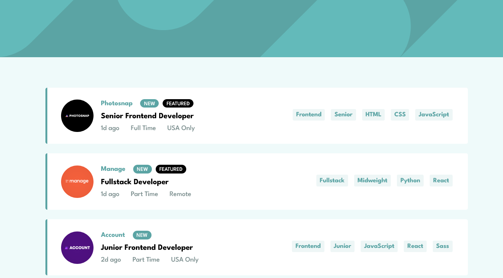

# Frontend Mentor - Job listings with filtering solution

This is a solution to the [Job listings with filtering challenge on Frontend Mentor](https://www.frontendmentor.io/challenges/job-listings-with-filtering-ivstIPCt). Frontend Mentor challenges help you improve your coding skills by building realistic projects.

## Table of contents

- [Overview](#overview)
  - [The challenge](#the-challenge)
  - [Screenshot](#screenshot)
  - [Links](#links)
- [My process](#my-process)
  - [Built with](#built-with)
- [Author](#author)

## Overview

### The challenge

Users should be able to:

- View the optimal layout for the site depending on their device's screen size
- See hover states for all interactive elements on the page
- Filter job listings based on the categories

### Screenshot

### Links

- Live Site URL: [https://sanketcharanpahadi.github.io/job-listings-with-filtering/](https://sanketcharanpahadi.github.io/job-listings-with-filtering/)
- Solution URL: [https://www.frontendmentor.io/solutions/job-listings-with-filtering-solution-using-html-css-and-javascript-3YgPU1ppMZ](https://www.frontendmentor.io/solutions/job-listings-with-filtering-solution-using-html-css-and-javascript-3YgPU1ppMZ)

## My process

### Built with

- Semantic HTML5 markup
- CSS custom properties
- Flexbox
- Mobile-first workflow

## Author

<!-- - Website - [Add your name here](https://www.your-site.com) -->

- Frontend Mentor - [@sanketcharanpahadi](https://www.frontendmentor.io/profile/sanketcharanpahadi)
- Twitter - [@SanketK86551440](https://www.twitter.com/SanketK86551440)
